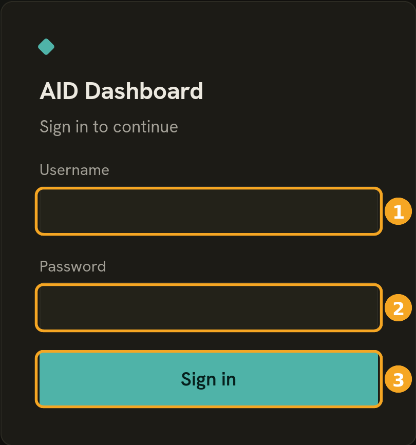
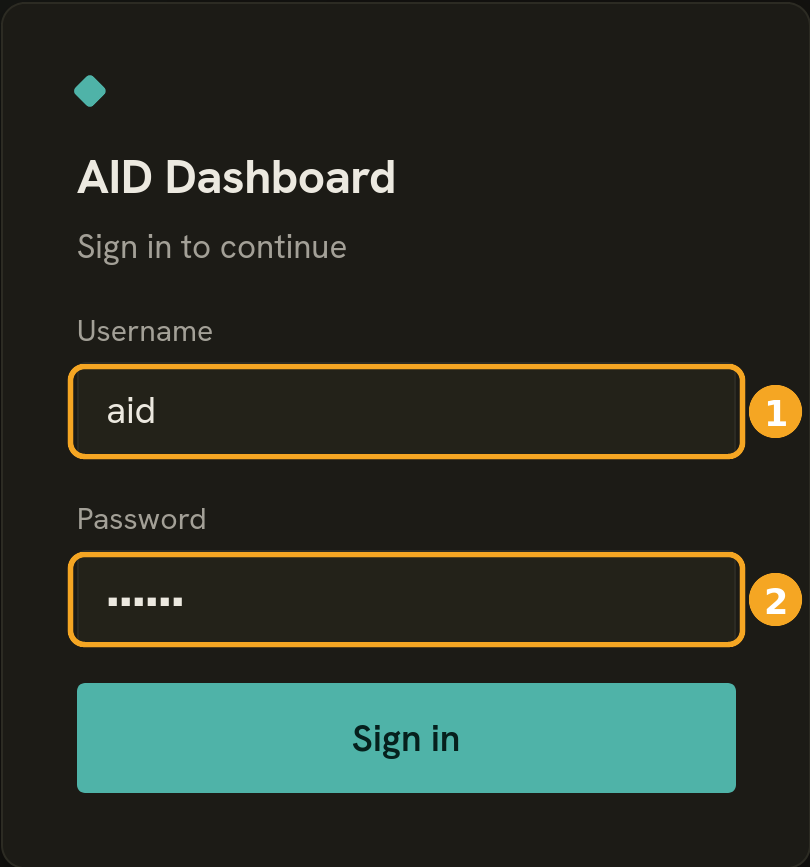
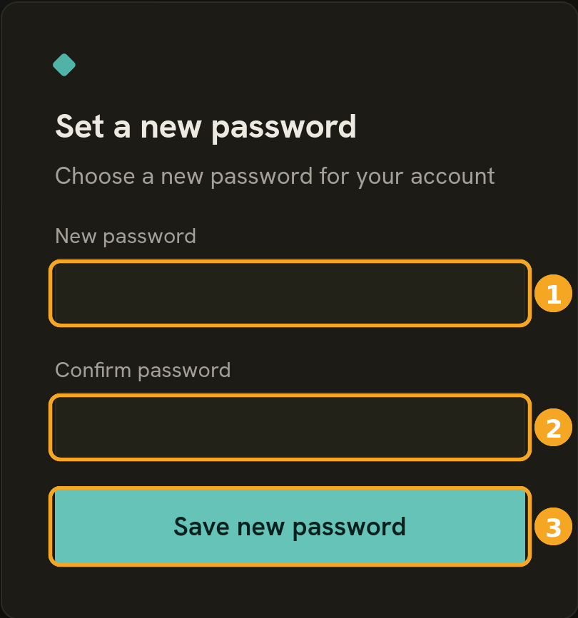

# AID2.0

> A C++20 daemon that turns phone calls into ticket-tracker work, with pluggable ticket and address-book backends.


When a call comes in, your phone system sends a small JSON event to `POST /call`, and
AID2.0 does the rest. It looks the caller up in an address book, works out which
project the call belongs to, and creates or updates the matching ticket in your
tracker. Operators see it all happen live on a bundled dashboard.

The ticket tracker and the address book are not built in. Each one is a plugin loaded
with `dlopen` behind an abstract *port*. [OpenProject](https://www.openproject.org/)
for tickets and DaviCal/CardDAV for contacts are simply the two backends that come in
the box. Write your own plugin against the `TicketStore` or `AddressBook` port and the
same daemon will drive Jira, a CRM, or an in-house system, with no change to the core.

<p align="center">
  
</p>

## Contents

- [Highlights](#highlights)
- [User Guide](#user-guide)
  - [Installation](#installation)
  - [Signing in and passwords](#signing-in-and-passwords)
  - [Using the dashboard](#using-the-dashboard)
- [Integration and API documentation](#integration-and-api-documentation)
- [Quick start](#quick-start)
- [Project layout](#project-layout)
- [Tech stack](#tech-stack)
- [License](#license)

## Highlights

- **Pluggable backends.** The ticket tracker and address book are `.so` plugins behind
  clean ports. You can swap a backend without touching the core.
- **Stateless core.** The daemon has no database of its own. Call state lives in the
  ticket backend. The only local state is a small SQLite `auth.db` that holds dashboard
  logins.
- **Durable and ordered.** Every event goes into a write-ahead log and is flushed to
  disk before the `202` reply. A per-`callid` mailbox keeps one call's events in order,
  while different calls run in parallel.
- **Live operator dashboard.** A bundled SvelteKit UI over REST and WebSocket at `/ui/*`.
- **Plugin-safe architecture.** The core is kept apart from the Drogon HTTP layer, so a
  plugin can never reach into framework internals.
- **Tested and hardened.** A GoogleTest suite, ASan and UBSan builds, Argon2id logins
  (libsodium), and XXE-hardened XML parsing.

## User Guide

This part is for the people who run and use AID2.0 every day. That means the
**administrator** who installs it on a server, and the **operators** who watch calls
turn into tickets on the dashboard. It assumes the ticket system (OpenProject) and the
address book (CardDAV/DaviCal) are already running on your network.

Here is the shape of it. A phone rings, a ticket appears on the board, and the operator
answers. The ticket then shows who is on the call right now. When the call ends the
ticket stays open for follow-up until someone closes it.

### Installation

The installer is an interactive wizard. You run one command, answer a few questions,
and it builds AID2.0 from the checkout and installs it as a background service under
systemd. After that the checkout is disposable.

Before you start, have these ready:

- A Debian-style Linux server with `sudo` access.
- The AID2.0 source checkout on that server. The installer builds it right on the
  machine, so the daemon and its plugins are always one matched build.
- Your OpenProject instance reachable over the network. You need a project for calls
  (its statuses and the custom fields AID uses), an API token, and a user login for the
  dashboard.
- Your CardDAV / DaviCal address-book URLs and credentials.
- A webhook secret (any strong string) if you want OpenProject edits to show up live on
  the dashboard.

You also choose a **recovery key** during setup. It is a master password that can reset
any dashboard account. Pick a strong one and keep it somewhere safe. You will want it
the first time someone forgets their password.

Run the installer from the checkout:

```sh
sudo ./scripts/install.sh
```

It installs the build dependencies and compiles the daemon, the admin tool, and both
backend plugins together. On a fresh machine it then launches the setup wizard. If you
want the service to run under an existing account, use
`sudo ./scripts/install.sh --run-as <username>`.

The wizard asks one question at a time. Each has a sensible default in brackets that you
can accept by pressing Enter.

| Prompt | What to enter |
|---|---|
| **Port for AID** | the port the daemon listens on (default `8088`) |
| **Membership poll interval** | how often it re-checks OpenProject project membership (default `30`s, `0` disables) |
| **OpenProject objects created?** | confirm you have created the project, statuses, and fields it lists |
| **Webhook secret** | your shared secret, or paste the whole OpenProject payload URL |
| **OpenProject API token** | the API token (kept secret, never logged) |
| **DaviCal URLs / user / password** | your address-book addresses, companies books, and login |
| **Incognito caller subject** | the ticket title used for withheld-number calls (default `Incognito Caller`) |
| **Session lifetime / cookie name** | dashboard login session settings (the defaults are fine) |
| **Log level** | `INFO` is the sensible default |
| **Recovery key** | your master password for account recovery, so store it safely |
| **Dashboard username** | the first operator login, which must match an OpenProject login |
| **Dashboard password** | that operator's password (at least 8 characters) |

Then it auto-discovers the OpenProject status and field IDs for you. If OpenProject
happens to be unreachable at that moment, you can skip discovery and fill them in later.
The service still installs. It just stays parked until you finish.

What it installs: the daemon and admin tool go in `/usr/local/bin/`. Data (plugins,
dashboard, database, logs) goes under `/var/lib/aid-daemon/` and `/var/log/aid-daemon/`.
The configuration lives at `/etc/aid-daemon/config.json`, and there is a systemd unit
called `aid-daemon.service`. Because it built everything on the machine, you do not need
the source checkout to run the service afterwards.

A few manual steps are left to you. The installer does not touch your firewall or
OpenProject, and it prints the exact steps to finish. In short:

- **Firewall.** Let your phone system and your OpenProject host reach the daemon's port,
  for `POST /call` and the webhook. Let the daemon reach OpenProject and DaviCal.
- **OpenProject.** Point its outgoing webhook at `http://<your-host>:<port>/hook/ticket`
  and pass the webhook secret.

Manage the service with the usual systemd commands:

```sh
systemctl status aid-daemon      # is it running?
systemctl restart aid-daemon     # apply a config change
journalctl -u aid-daemon -f      # follow the logs
```

To upgrade later, pull the new source and run `sudo ./scripts/install.sh` again. It
notices the existing install, rebuilds, swaps the binaries, plugins, and dashboard
atomically, and restarts. Your configuration, users, and call data are left untouched.

### Signing in and passwords

Open the dashboard in a browser at `http://<your-host>:<port>/`. The sign-in screen is
the first thing you see.



1. **Username.** Your operator login. It is the same name as your OpenProject login,
   which is how AID knows which calls and tickets are yours.
2. **Password.** Your dashboard password.
3. **Sign in.** Takes you through to the dashboard.

To leave, use the **Log out** button in the top-right corner.

**Forgot your password?** There is no email reset here. Instead there is the recovery
key, the master password your administrator set during installation. It can set a new
password for any account. To reset a password:

1. On the sign-in screen, type the username whose password you want to reset.
2. In the password box, type the recovery key instead of a password.
3. Click **Sign in**.



Because the recovery key was recognised, you land on a **Set a new password** screen
instead of the dashboard:



1. **New password.** Pick a new password, at least 8 characters.
2. **Confirm password.** Type it again.
3. **Save new password.** The account is updated.

You go back to the sign-in screen. Log in with the new password. The recovery key does
not change, so you can use it again whenever you need to.

> **Keep the recovery key safe.** Anyone who has it can reset any operator's password.
> Treat it like an administrator credential and store it in your password manager, not
> on a sticky note.

New operator accounts are created by the administrator on the server, and each dashboard
login has to match an OpenProject login.

### Using the dashboard

The dashboard is your live view of incoming and ongoing calls. It updates on its own, so
there is no need to refresh.

**The top bar.**


From left to right you get the **AID Dashboard** logo, and on the right your signed-in
username, a light and dark theme toggle, a health indicator, and **Log out**. The health
indicator reads **Ok** when the daemon and its backends are healthy. If it shows anything
else, tickets may not be updating, so let your administrator know.

**The live-call banner.** While you are on a call, a highlighted banner sits at the top
of the board so you can see the current caller at a glance:


1. **Live indicator.** The pulsing "Active call" marker means this call is happening
   right now.
2. **Caller.** The number or contact name of the person you are speaking to.
3. **Project and ticket.** The project the call was routed to, plus a link that opens the
   ticket in OpenProject.
4. **Caller contact.** The matched address-book contact: name, company, phone numbers,
   and projects. If the number is not in your address book, this reads "No matching
   contact" instead.

The banner appears when you accept a call and clears once the call ends.

**The ticket list.** Below the banner is the list of open tickets. Closed ones drop off
the board automatically, because this is a live worklist and not an archive. Each row is
one ticket:


1. **Status.** `New` (ringing, not yet answered) or `In progress` (being handled).
2. **Subject.** The caller's name or number, with the ticket number and project just
   beneath it.
3. **Caller and dialed number.** Who called, and the number they dialed.
4. **Assignee.** The operator handling it, or unassigned.
5. **Open in OpenProject.** Jump to the full ticket in OpenProject.

**Seeing who is on a call.** Rows for calls happening right now carry a small badge next
to the subject. Your own active call shows a green **LIVE** badge:


A colleague's active call shows a grey **"&lt;name&gt; · on call"** badge. You can see it
because you share the ticket's project, even though the call is not yours:


Between them, these badges let a whole team, or a supervisor watching the board, see who
is tied up on a call at any moment.

**Working a ticket.** Click a row to expand it. You see the call's details along with the
actions you need:


- **Add a comment.** Jot a note about the call. It is saved on the ticket and shows up in
  OpenProject.
- **Send comment.** Posts your note to the comments list above the box.
- **Close ticket.** Marks the ticket done and takes it off the board.

> **Ending a call does not close the ticket.** When the caller hangs up, the ticket stays
> **In progress** so you can finish your notes and follow up. Close it yourself with
> **Close ticket** once the work is done.

**A typical call, start to finish.** A call comes in and a **New** ticket appears. You
answer, the live-call banner shows the caller, and the ticket flips to **In progress**
with you as the assignee. You add a comment. The caller hangs up and the banner clears,
but the ticket stays open. Once you have wrapped up any follow-up, you close the ticket
and it leaves the board.

## Integration and API documentation

For connecting a phone system or writing a backend plugin, the developer documentation
lives in [`docs/`](docs/). Start with [Getting started](docs/10-getting-started.md) to
run the daemon and send it a call, then read the chapters in order.

| # | Chapter | What it covers |
|---|---------|----------------|
| 1 | [Architecture](docs/01-architecture.md) | Layers, the plugin-safe core versus the Drogon zone, end-to-end data flow |
| 2 | [Integrating the Call API](docs/02-integrating-call-api.md) | `POST /call`, the five event shapes, request and response, status codes, ordering |
| 3 | [Integrating the Address Book](docs/03-integrating-the-address-book.md) | How your CardDAV books must be set up: numbers, names, project ids, the lookup |
| 4 | [Webhook and Health](docs/04-webhook-and-health.md) | `POST /hook/ticket` for live edit reflection, and `GET /health` |
| 5 | [Writing a plugin](docs/05-writing-a-plugin.md) | The port ABI: factory symbols, contract tags, interfaces, reducer and retry, testing, CMake |
| 6 | [Value types](docs/06-value-types.md) | `Ticket`, `Contact`, `CallEvent`, `Error`, dashboard types, the ticket state machine |
| 7 | [Configuration](docs/07-configuration.md) | The config JSON schema, every section and default |
| 8 | [Operational model](docs/08-operational-model.md) | WAL durability, the per-callid mailbox, caps, graceful shutdown |
| 9 | [How calls become tickets](docs/09-how-calls-become-tickets.md) | The behaviour model: routing, which events create versus update, the ticket lifecycle |
| 10 | [Getting started](docs/10-getting-started.md) | Build, run, send your first call, and a full worked call trace |
| 11 | [Building, testing and scripts](docs/11-building-testing-and-scripts.md) | Build the daemon, run the tests, and the helper scripts |
| 12 | [Troubleshooting and glossary](docs/12-troubleshooting-and-glossary.md) | Common "why didn't it work" cases, reading the signals, and a glossary |

## Quick start

```sh
./scripts/build.sh      # cmake configure + build into build/
./scripts/test.sh       # build + run the GoogleTest suite
./scripts/sanitize.sh   # ASan + UBSan build/run into build-asan/
./scripts/format.sh     # clang-format every source file
```

The operator dashboard (SvelteKit) builds separately:

```sh
./scripts/build-ui.sh   # pnpm install + vite build in ui/
```

## Project layout

| Path | What lives here |
|---|---|
| `include/aid/` | Public headers (namespace `aid`) |
| `lib/` | Core library, layered and backend-shape-agnostic |
| `src/` | Application entry points (daemon and admin CLI) |
| `tests/` | GoogleTest suite |
| `ui/` | SvelteKit operator dashboard |
| `cmake/` | CMake helper modules (sanitizers, dependency probes) |
| `scripts/` | Thin wrappers over cmake, ctest, and pnpm |
| `docs/` | Documentation: integration guide and user guide |

## Tech stack

C++20, [Drogon](https://github.com/drogonframework/drogon) for HTTP and WebSocket, CMake
with Ninja, GoogleTest, and a SvelteKit/Vite dashboard.

Most third-party C++ dependencies are pinned with CMake `FetchContent`: Drogon,
nlohmann/json, libxml2, and GoogleTest. A few come from the host system instead:
`libphonenumber`, `libsqlite3`, and `libsodium`. Each of those is wrapped as an
`INTERFACE` target after a `try_compile` probe. The inline comments in
[`CMakeLists.txt`](CMakeLists.txt) explain the reason for each one.

## License

Released under the MIT License. See [`LICENSE`](LICENSE).
