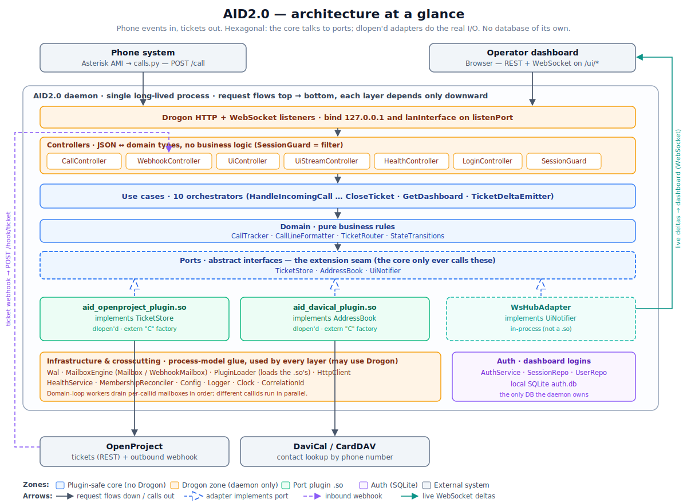
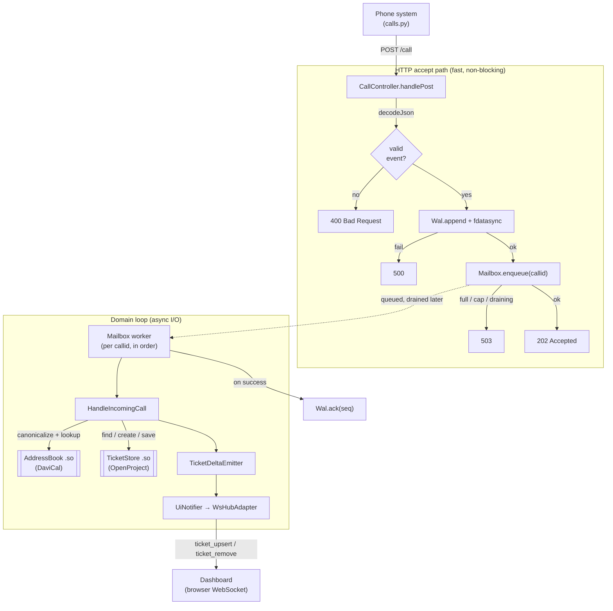

# 1. Architecture

[← Back to index](README.md)

AID2.0 is a single, long-lived process built along the [ports-and-adapters
(hexagonal)](https://en.wikipedia.org/wiki/Hexagonal_architecture_(software))
pattern. The business logic never talks to OpenProject, CardDAV, or the web
framework directly. It talks to **ports** — abstract interfaces — and concrete
**adapters**, loaded as `.so` plugins, do the actual I/O. That one seam is what
lets you bind a different phone system, ticket tracker, or address book.

## 1.1 The two zones

One hard rule splits the whole codebase: who is allowed to see the web framework.

- **The plugin-safe core (no Drogon).** `value-types`, `plumbing`, `domain`,
  `ports`, `usecases`, `auth`, and `serialization` link nothing but the standard
  library and each other. A plugin `.so` links against this core — specifically
  `aid_ports` — and stays clear of any web-framework dependency.
- **The Drogon zone (daemon only).** `controllers`, `infrastructure`,
  `crosscutting` (in part), and the WebSocket hub are allowed to use Drogon. This
  is the process shell: the listeners, the mailbox engine, the WAL, the HTTP
  client, config, logging.

Nothing here rests on convention — it's enforced by **CMake target visibility**.
`aid_ports`, for instance, is an `INTERFACE` library whose only transitive
dependencies are `aid_value_types` and `aid_plumbing`, so a source file under
`ports/` that `#include`d a Drogon header would flat-out fail to compile. The full
dependency matrix lives in the `CMakeLists.txt` files under `lib/`.

Why does this matter to you as an integrator? Your plugin inherits the same
discipline for free. It links `aid_ports` + stdlib + whatever third-party deps you
bring, and there's no way for it to accidentally drag in the framework.

## 1.2 The ports (the extension seam)

Everything the core needs from the outside world is captured by three abstract
ports. Two of them are backed by `dlopen`'d plugins:

| Port | Backed by | Role |
|---|---|---|
| `TicketStore` | `aid_openproject_plugin.so` | create/find/update/close tickets, resolve users, build dashboard rows |
| `AddressBook` | `aid_davical_plugin.so` | canonicalize a phone number, look up the contact |
| `UiNotifier` | `WsHubAdapter` (in-process, **not** a `.so`) | push live deltas to dashboard WebSockets |

Binding a new ticket tracker means implementing `TicketStore`; a new contact
source means implementing `AddressBook`. That's covered in
[Writing a plugin](05-writing-a-plugin.md). The interfaces themselves live in
`include/aid/ports/`.

## 1.3 End-to-end data flow

Here's what happens when your phone system reports an incoming call. The HTTP
accept path is kept deliberately tiny: validate, make the event durable, return
`202`. All the real work — the OpenProject and CardDAV I/O — happens afterward, on
a dedicated "domain loop," so upstream latency can never block the socket that's
accepting new events.

A few properties fall out of this:

- **Durable before it's acknowledged.** The event is `fdatasync`'d to the WAL
  *before* the `202` goes back, so a crash the instant after the client sees `202`
  still replays that event on restart.
- **Ordered per call.** Every event for a given `callid` runs on one worker,
  strictly in order (Incoming → Accepted → Transfer → Hangup). Different callids
  run concurrently.
- **The 409 retry stays hidden.** OpenProject uses optimistic locking, and the
  `TicketStore` adapter swallows `409 Conflict` with a bounded retry loop, so the
  use case only ever sees the final result. More on this in the
  [Operational model](08-operational-model.md).

## 1.4 Why plugins never see Drogon

Plugins do async HTTP, and they do it on the daemon's own event loop — but that
loop crosses the `extern "C"` boundary as a bare `void*`, never as a
`trantor::EventLoop*`. The plugin casts it back internally. Keeping the framework
types off the ABI like this means the daemon and a plugin can be compiled and
shipped independently, as long as they agree on the ABI tags (see
[Writing a plugin §5.3](05-writing-a-plugin.md)).

> **Layering note.** The two *shipped* plugins are a documented exception: they
> privately reuse the daemon's `HttpClient` (in `aid_infrastructure`) and a few
> pure `aid_domain` helpers. A generic third-party plugin needs none of that — it
> links only `aid_ports` + stdlib + its own HTTP/parse libraries. Either way, no
> Drogon type ever crosses the boundary.

---

Next: [Getting started →](10-getting-started.md)
