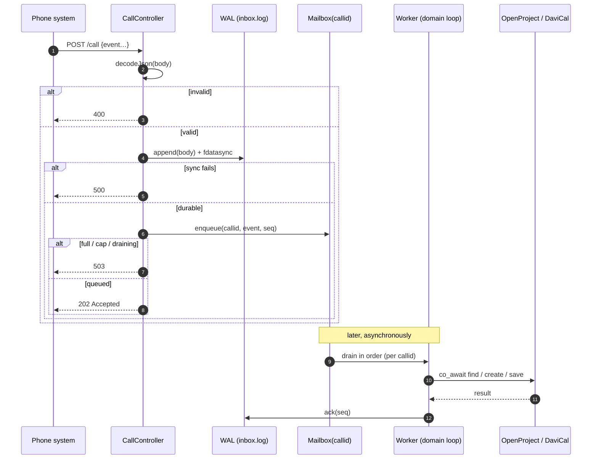

# 2. Integrating the Call API

[← Getting started](10-getting-started.md) · [Back to index](README.md)

This is the chapter to read when you're connecting a phone system. Your PBX — or a
small bridge script in front of it — reports call events by POSTing JSON to a
single endpoint. A typical bridge listens to your PBX (for example Asterisk's AMI)
and emits these events; this chapter is the authority for the wire format.

> What follows is the *wire format*: the exact JSON to send. For what each event
> actually *does* to a ticket — routing, which events create versus update, the
> ticket lifecycle — see the companion chapter,
> [How calls become tickets](09-how-calls-become-tickets.md). You'll want both to
> integrate correctly.

## 2.1 The endpoint

```
POST /call
Content-Type: application/json      (body is parsed as JSON regardless)
```

The daemon serves `/call` on its configured `listenPort` (see
[Configuration](07-configuration.md)), on both the loopback address and the
configured LAN interface.

> **Proxy note.** The reference `calls.py` posts to
> `http://localhost/cgi-bin/aid/call` (port 80). That legacy path is a
> reverse-proxy / CGI mapping sitting in front of the daemon — it is *not* a route
> the daemon itself serves. Point your integration at `POST /call` on the daemon's
> own port, or replicate the proxy rewrite in your deployment. The repo's test
> driver `scripts/calltrigger.sh` posts straight to `http://<host>:<port>/call`.

## 2.2 Authentication — there is none at the HTTP layer

`/call` has no HTTP authentication at all. The trust model is network-level:
loopback plus LAN. Any client that can reach the port can POST any event. No API
key, no bearer token, and no `401` on this endpoint.

There *is* an authorization concept, but it sits deeper. The `user` / `newuser`
handle that some events carry is checked against the known-users table inside the
use case. An unknown handle doesn't reject the request — instead it quietly drops
the *assignee* on the resulting ticket and processes the call anyway. So don't
expect a rejection when you send an unrecognized operator login; expect an
unassigned ticket.

If you need this endpoint reachable beyond a trusted network, put it behind your
own authenticating reverse proxy.

## 2.3 The five event shapes

Every event is a flat JSON object, with a string `event` field that selects the
shape. The field names and types below are exactly what the daemon's decoder
(`CallController::decodeJson`) accepts, cross-checked against `calls.py`.

> **Mind the exact strings.** The hangup event is `"Hangup"` — with *no* `" Call"`
> suffix, unlike the other four. And the transfer event's operator field is
> `newuser`, all lowercase, not `user`.

| `event` | Required fields | Optional | Notes |
|---|---|---|---|
| `"Incoming Call"` | `remote`, `callid`, `dialed` | — | inbound ringing |
| `"Accepted Call"` | `callid`, `remote`, `dialed` | `user` | operator answered; `user` absent when the connected line is `<unknown>` |
| `"Outgoing Call"` | `callid`, `remote`, `user` | — | operator dials out; **no `dialed`** field |
| `"Transfer Call"` | `callid`, `newuser` | — | call handed to another operator |
| `"Hangup"` | `callid`, `remote` | — | call ended |

What the fields mean:

- **`callid`** — the call's unique id (Asterisk's `Uniqueid`). This doubles as the
  mailbox key: all events that share a `callid` are processed in order and attach
  to the *same* ticket. Reuse one stable, unique `callid` across a call's whole
  lifecycle (Incoming → Accepted → Hangup). There's one wrinkle: a `Transfer Call`
  may legitimately carry a *different* id — the transferee's Uniqueid — and the
  daemon matches it by substring, so transfers still land on the right ticket
  ([§9.2](09-how-calls-become-tickets.md)).
- **`remote`** — the external party's number. Inbound and hangup, that's the
  caller; outgoing, it's the dialed external number (`calls.py` maps Asterisk's
  `Exten` here for outgoing).
- **`dialed`** — the number that was called on your side (Asterisk's `Exten`).
- **`user` / `newuser`** — the operator's login handle. `calls.py` lowercases it
  and keeps only the first whitespace-delimited word.

Miss a required field, send a non-string field, hand over unparseable JSON, or use
an unrecognized `event` string, and the whole request comes back `400`.

### Example payloads

```jsonc
// Incoming Call
{"event": "Incoming Call", "remote": "+4915112345678", "callid": "1699999999.123", "dialed": "+493022220"}

// Accepted Call (operator known)
{"event": "Accepted Call", "callid": "1699999999.123", "remote": "+4915112345678", "dialed": "+493022220", "user": "alice"}

// Accepted Call (connected line was "<unknown>": user omitted)
{"event": "Accepted Call", "callid": "1699999999.123", "remote": "+4915112345678", "dialed": "+493022220"}

// Outgoing Call (no "dialed")
{"event": "Outgoing Call", "callid": "1699999999.456", "remote": "+4930111222", "user": "alice"}

// Transfer Call (field is "newuser")
{"event": "Transfer Call", "callid": "1699999999.123", "newuser": "bob"}

// Hangup (event string is exactly "Hangup")
{"event": "Hangup", "callid": "1699999999.123", "remote": "+4915112345678"}
```

Try one with `curl`:

```sh
curl -i -X POST http://127.0.0.1:8080/call \
  -H 'Content-Type: application/json' \
  -d '{"event":"Incoming Call","remote":"+4915112345678","callid":"test-1","dialed":"+493022220"}'
# → HTTP/1.1 202 Accepted
```

## 2.4 Responses

`/call` returns a status code and an empty body. Four outcomes are possible:

| Code | Meaning | When |
|---|---|---|
| `202 Accepted` | event durably accepted and queued | happy path |
| `400 Bad Request` | could not decode | unparseable JSON, missing/non-string required field, or unknown `event` |
| `500 Internal Server Error` | durability failure | the WAL append/fsync failed (e.g. disk full) — the event was **not** accepted |
| `503 Service Unavailable` | backpressure | the per-callid queue is full (32), the process-wide mailbox cap is reached, or the daemon is draining for shutdown |

Remember that `202` means *durable and queued*, not *processed* — the ticket gets
created or updated asynchronously afterward. Treat a `503` as "retry shortly," and
a `500` as "the event was lost, resend it."

## 2.5 Request lifecycle



## 2.6 Ordering guarantee

The `callid` is the ordering key. For a single call, send the events in their
natural order and the daemon processes them in that order — one worker per
`callid`, one event in flight at a time. Two different calls (`callid` A and B) run
concurrently and independently.

This matters for correctness. An `Accepted Call` that arrives ahead of its
`Incoming Call` under the same `callid` would be handled out of order. So long as
your bridge POSTs events in the sequence the PBX emits them, ordering holds — the
daemon won't reorder or buffer to "wait for" an earlier event.

---

Next: [Integrating the Address Book →](03-integrating-the-address-book.md)
