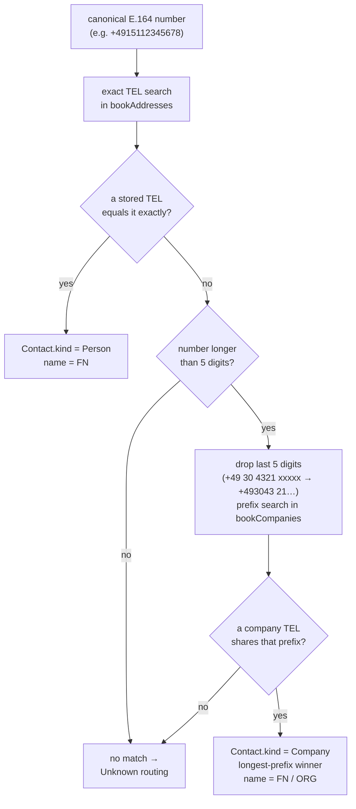

# 3. Integrating the Address Book

[← Integrating the Call API](02-integrating-call-api.md) · [Back to index](README.md)

The [Call API](02-integrating-call-api.md) chapter covered how your PBX *reports* a
call. This chapter handles the other half of the input: telling the daemon who is
calling and where their ticket belongs. Nothing in a `/call` payload names a
project or a person. The daemon takes the caller's number, looks it up in your
CardDAV address books, and whatever contact it finds decides the routing.

> **Who §3.1 is for.** The first section is written for whoever sets up the
> contacts — the DaviCal administrator who creates the login, creates the two
> address books, and enters the callers. No code, no C++. Read §3.1 and you'll know
> exactly how to store a number, a name, and a project. The sections after it (§3.2
> onward) are the precise reference for developers, and for anyone binding a
> *different* contact backend.

> This is the lever you pull to route calls. Populate the books correctly and known
> callers land in the right project with the right ticket title; leave a caller out
> and their calls fall through to the "unknown" project. The rules those contacts
> feed into are in [How calls become tickets](09-how-calls-become-tickets.md).

The shipped backend is the `aid_davical_plugin.so` adapter, talking to
[DaviCal](https://www.davical.org/) over
[CardDAV](https://datatracker.ietf.org/doc/html/rfc6352). Swapping in a different
contact source is just a plugin swap ([Writing a plugin](05-writing-a-plugin.md)).

## 3.1 How your two address books must be set up

Before any call can be routed, someone has to enter the callers, and this section
is for that person. There's no code involved. You (1) create a login the daemon can
use, (2) create two address books, and (3) fill each with contacts that follow one
fixed shape. Get the shape right and every known caller lands in the correct
project automatically.

### Step 1 — a login for the daemon

In DaviCal, create a user for the daemon to sign in as — `aid` by convention — and
give it read access to the two books below. The daemon authenticates with exactly
these credentials (`user` / `password` in the `AddressSystem` config section) on
every lookup, and reads nothing else in DaviCal.

### Step 2 — create two address books

Create two separate address books (CardDAV collections) and put their URLs in the
config ([Configuration §7.3](07-configuration.md)):

```jsonc
"AddressSystem": {
  "bookAddresses": "http://localhost/davical/caldav.php/aid/addresses/",  // ← book 1: people
  "bookCompanies": "http://localhost/davical/caldav.php/aid/companies/",  // ← book 2: companies
  "user":     "aid",
  "password": "…",
  "defaultRegion": "DE"     // the country your phone system's national numbers belong to
}
```

Why two books instead of one? Because a person and a company get matched in
opposite ways:

- **`addresses` — one person, one number.** You store a human being's own phone
  number, and a call matches only if it's *exactly* that number. Use this book for
  individuals: a customer's mobile, a contact's direct line.
- **`companies` — one main number, many extensions.** A company has a switchboard —
  say `+49 30 4321` — and every desk behind it dials out as `+49 30 4321 00042`,
  `+49 30 4321 00087`, and so on, a different number on each call. You can't list
  them all, so you store the company's main number once and the daemon matches any
  call whose number *starts with* that main number. Every extension of the firm
  then routes to the same projects.

The daemon always tries `addresses` first (the exact person match); only when that
misses does it try `companies` (the main-number prefix match). Keep people in
`addresses` and firms in `companies` — a contact in the wrong book won't match the
way you'd expect.

### Step 3 — what a contact must look like

Every contact is a vCard, and for routing purposes the daemon cares about only
three things you fill in: the caller's name, their phone number, and the project
id(s) their calls should go to. Everything else — email, postal address, notes — is
yours to use and the daemon ignores it.

**A person** — goes in the `addresses` book:

```vcf
BEGIN:VCARD
VERSION:3.0
FN:Max Mustermann              ← the name (becomes the ticket title)
TEL;TYPE=CELL:+4915112345678   ← the phone number, in international +… form
X-CUSTOM1:3                    ← the OpenProject project id this caller belongs to
END:VCARD
```

A call from `+4915112345678` now matches Max exactly and opens (or updates) a
ticket in project `3` titled **"Max Mustermann"**.

**A company** — goes in the `companies` book:

```vcf
BEGIN:VCARD
VERSION:3.0
FN:Acme Corp                   ← the company name (becomes the ticket title)
ORG:Acme Corp                  ← organisation — optional, same purpose as FN
TEL;TYPE=WORK:+49304321        ← the SWITCHBOARD main number only — NO extension
X-CUSTOM1:3,5                  ← one or more project ids, comma-separated
END:VCARD
```

A call from `+493043210042` — someone at extension `0042` behind Acme's switchboard
— matches no person, so the daemon strips the extension and matches the leading
digits against Acme's stored `+49304321`. The call routes to Acme's projects, titled
**"Acme Corp"**. Keep the switchboard number short (`+49304321`, no placeholder
extension); a longer stored value only narrows what can match it.

### The three fields, spelled out

| You fill in | vCard line | The rule — get this right |
|---|---|---|
| **Name** | `FN:` | **Required.** Any text; it becomes the ticket title. A contact with no `FN` is ignored entirely. |
| **Phone number** | `TEL:` | Must be **international E.164 form**: a leading `+`, country code, then digits — **no spaces, no brackets, no leading `0`**: `+4915112345678`, never `0151 12345678`. In the `companies` book, store the **main/switchboard** number *without* an extension. You may add several `TEL` lines (desk + mobile); each is matched. |
| **Project id(s)** | `X-CUSTOM1:` | The OpenProject **project id number(s)** the caller belongs to — one, or several separated by commas (`3,5,8`). Leave it off and the caller is "unknown": the call still creates a ticket, but in the fallback project, not theirs. |

> **The phone-number rule is the one that bites.** The daemon rewrites every
> incoming call number to `+countrycode…` form *before* it searches your books, so a
> number stored as `0151 12345678` or `(0151) 12345678` will never match. Store
> every `TEL` as `+…` with digits only. A stray space at the very start or end of
> the value is tolerated; spaces *inside* the number are not. The `defaultRegion`
> setting is only the hint used to expand your PBX's national-format numbers — set
> it to your country so `030…` becomes `+4930…`.

## 3.2 What the daemon reads from a vCard

For every contact the lookup returns, the parser reads exactly four vCard
properties and ignores everything else. Property names are matched
case-insensitively, and parameters (anything after a `;` in the property name, such
as `TEL;TYPE=CELL`) are allowed and ignored.

| vCard property | Maps to | Meaning |
|---|---|---|
| `FN` | `Contact.name` | **Required.** The display name and the default ticket subject for a known caller. A vCard with no `FN` is treated as malformed and skipped. |
| `ORG` | `Contact.companyName` | Optional. The organisation name; used as the subject for a company caller. |
| `TEL` | `Contact.phoneNumbers[]` | The number(s) to match against. **Multi-value** — a contact may carry several `TEL` lines (desk + mobile); each is matched independently. Must be E.164 (§3.3). |
| `X-CUSTOM1` | `Contact.projectIds[]` | The OpenProject project id(s) this contact routes to, comma-separated (§3.4). |

Everything else in the vCard (`N`, `EMAIL`, `ADR`, `NOTE`, photos, and so on) is
left untouched and does no harm — store whatever you like for your own bookkeeping.

> vCard line folding (RFC 6350 §3.2 — a continuation line that starts with a space
> or tab) is unfolded before parsing, so a long `X-CUSTOM1` list that your CardDAV
> client wraps across lines still parses correctly.

## 3.3 Phone numbers must be stored in E.164

When a call arrives, the daemon canonicalizes the wire `remote` number to
[E.164](https://en.wikipedia.org/wiki/E.164) (`+<country><subscriber>`, digits
only) with libphonenumber, using `defaultRegion` as the hint for numbers that
arrive in national format. It then matches that canonical string against your
stored `TEL` values. A few things follow from that:

- **Store every `TEL` in E.164:** `+4915112345678`, not `0151 12345678` and not
  `(0151) 12345678`. A national-format or spaced value in the book will simply never
  match — the daemon doesn't reformat what's stored there. This is address-book
  hygiene, and it's on you.
- **Surrounding whitespace is tolerated.** A stored `TEL: +49304321` with a stray
  leading or trailing space still matches — a real hand-entry slip that once
  mis-routed a company. The daemon trims it before comparing. Internal spaces are a
  different story: `+49 30 4321` is a national-style value and won't match.
- **Withheld or unparsable callers never reach the address book.** When the incoming
  number canonicalizes to empty (`<unknown>`, `anonymous`, `withheld`, `0`, junk),
  the call is classified Incognito and no lookup happens. You don't need a sentinel
  contact for these.

## 3.4 `X-CUSTOM1` — the routing field

`X-CUSTOM1` is what turns a matched contact into a *routed* one. It carries one or
more OpenProject project ids — the same numeric ids you list in the
`TicketSystem.projectNames` map ([Configuration §7.2](07-configuration.md)) — as a
comma-separated string:

```
X-CUSTOM1:3
X-CUSTOM1:3,5,8
X-CUSTOM1:3, 5, 8      ← surrounding spaces per id are trimmed; empty entries dropped
X-CUSTOM1:3\, 5\, 8    ← escaped commas are fine too — see below
```

Some address-book clients treat `X-CUSTOM1` as a single block of text and write the
commas you typed back escaped, as `3\, 5\, 8` (that's how a vCard escapes a comma
inside one value — you'll see it if you look at the raw record on the server). AID
un-escapes before splitting, so both spellings mean the same three projects. You do
not have to hand-edit the vCard.

What that gets you (the full rules are in [§9.1](09-how-calls-become-tickets.md)):

- **Non-empty `X-CUSTOM1` → the caller is "Known".** The call routes to one of these
  projects — the first that already has an open ticket for this caller, or else the
  first in the list. The ticket subject is the contact's `FN` (or `ORG`).
- **Empty or absent `X-CUSTOM1` → the caller is "Unknown".** Matching the number but
  assigning no project sends the call to the configured `unknownFallback` project,
  with the phone number as the subject. A contact without `X-CUSTOM1` routes nowhere
  special — filling in the name alone isn't enough.

The ids are OpenProject *project* ids (from the project's URL or API), not names.
`projectNames` in config only maps id → human label for logging; the id in
`X-CUSTOM1` is the source of truth for routing.

## 3.5 How a lookup runs

For a canonical incoming number, the daemon runs the two books in order and returns
on the first hit:



1. **Person pass** — an exact match on `bookAddresses`. The first contact whose
   (whitespace-trimmed) `TEL` equals the canonical number wins, stamped `Person`.
2. **Company pass** — only runs if the person pass missed *and* the number is longer
   than the 5-digit extension. Trim the last 5 digits, prefix-search `bookCompanies`,
   and if several companies match, the one whose stored `TEL` shares the longest
   common prefix with the full number wins, stamped `Company`.
3. **No hit** in either book, and the use case treats the caller as Unknown.

## 3.6 Setup checklist

- [ ] Two CardDAV collections exist in DaviCal, their URLs set as `bookAddresses`
      and `bookCompanies`, reachable with the configured `user` / `password`.
- [ ] People live in `bookAddresses`; companies in `bookCompanies`. Putting a
      company in the addresses book means only its exact main line matches (no
      extension routing).
- [ ] Every contact has an `FN`. No `FN`, no contact.
- [ ] Every `TEL` is E.164 (`+` country code, digits only, no internal spaces).
- [ ] Every contact you want *routed* has `X-CUSTOM1` set to real OpenProject
      project id(s). Name-only contacts fall back to the Unknown project.
- [ ] `defaultRegion` matches the country your PBX reports national-format numbers
      for, so they canonicalize to the right E.164 prefix.

At startup the daemon probes `bookAddresses` once (an authenticated `PROPFIND`) and
surfaces the result in [`GET /health`](04-webhook-and-health.md). If the address
book is unreachable or the credentials are wrong, that's where you'll see it.

---

Next: [How calls become tickets →](09-how-calls-become-tickets.md)
