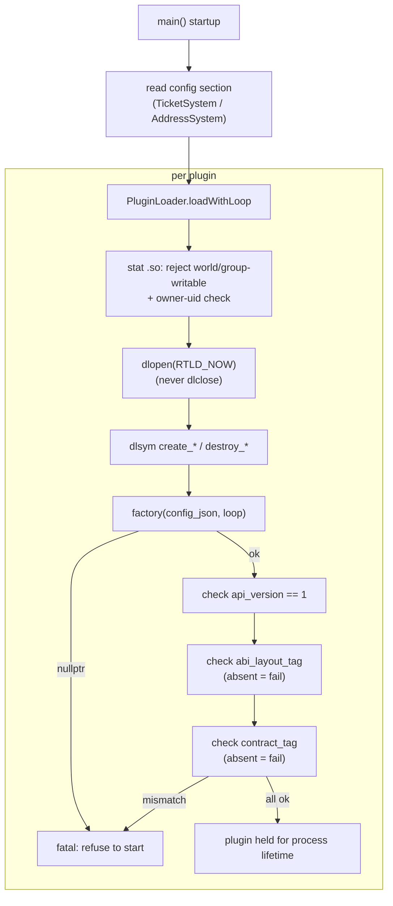

# 5. Writing a plugin

[← Webhook & Health](04-webhook-and-health.md) · [Back to index](README.md)

To bind a different ticket tracker or address book, you implement a port and ship
it as a `dlopen`'d `.so`. This chapter is the ABI contract: the symbols your `.so`
must export, the interface you have to implement, and the rules the daemon enforces
at load time.

Your reference implementations are the two shipped plugins —
`lib/adapters/openproject_plugin/` (a `TicketStore`) and
`lib/adapters/davical_plugin/` (an `AddressBook`).

## 5.1 The plugin model in one paragraph

At startup the daemon `dlopen`s each plugin `.so`, resolves a small set of
`extern "C"` symbols, verifies three ABI tags, and calls your factory to get back a
pointer to an object that implements the port's abstract C++ class. That object
lives for the entire process lifetime. The daemon never calls `dlclose`, and your
plugin never throws across the boundary — errors come back as values.

## 5.2 The five `extern "C"` symbols

Every port `.so` exports exactly five symbols. Here they are for `TicketStore` (for
`AddressBook`, just substitute the name — `create_AddressBook`, and so on):

```cpp
// The factory. `config_json` is the matching config section, verbatim.
// `event_loop` is a void*-erased trantor::EventLoop* (kept off the ABI as void*);
// cast it back inside if your plugin does async HTTP on the daemon's loop.
extern "C" aid::ports::TicketStore* create_TicketStore(const char* config_json, void* event_loop);

// The matching deleter. The daemon wraps your pointer in a unique_ptr whose
// deleter calls this. Body is typically `delete p;`.
extern "C" void destroy_TicketStore(aid::ports::TicketStore* p);

// Three ABI guard symbols (see §5.3).
extern "C" int         aid_plugin_api_version(void);      // return 1
extern "C" std::uint64_t aid_plugin_abi_layout_tag(void); // return aid::abi::kPluginAbiLayoutTag
extern "C" const char* aid_plugin_contract_tag(void);     // return aid::abi::kPluginContractTag
```

A few things worth knowing:

- There's also a classic factory shape — `create_TicketStore(const char*)` with no
  loop — for plugins that don't need the daemon's event loop. Both shipped plugins
  use the loop-aware shape shown above, and the daemon works out which one to call.
- Mark each exported symbol with default visibility
  (`__attribute__((visibility("default")))`) and set `CXX_VISIBILITY_PRESET hidden`
  on the target, so these five stay the *entire* public surface of your `.so`.
- The factory owns parsing of `config_json`. On any error at all — bad config, OOM,
  whatever — return `nullptr` rather than throwing. The loader reports `nullptr` as
  a clean startup failure.

## 5.3 The three ABI axes (why there are three tags)

The daemon and your plugin get compiled separately, and three independent things
can drift between them — so each one gets its own guard. All three are checked at
load, and a mismatch (or, for the last two, an *absent* symbol) refuses startup.

| Symbol | Guards | Value to return | Absent symbol |
|---|---|---|---|
| `aid_plugin_api_version` | the **factory contract** (shape of `create_*`/`destroy_*`) | `1` (`kExpectedPluginApiVersion`) | allowed (optional handshake) |
| `aid_plugin_abi_layout_tag` | the **in-memory layout** of every value type that crosses the boundary | `aid::abi::kPluginAbiLayoutTag` | **hard failure** |
| `aid_plugin_contract_tag` | **behavioural staleness** — a same-layout, same-API `.so` built from older source | `aid::abi::kPluginContractTag` (currently `"AID_PLUGIN_CONTRACT=4"`) | **hard failure** |

Each one catches a failure the others can't:

- **`abi_layout_tag`** is a compile-time FNV-1a hash of the `sizeof`/`alignof` of
  every boundary struct (`CallId`, `PhoneNumber`, `Ticket`, `NewTicket`, `Contact`,
  the dashboard types, `WebhookDecode`, `Error`). Add a field to `Ticket` on one
  side but not the other and the tags no longer match — which turns what would have
  been a silent heap-corruption crash into a refusal to start. You don't compute it
  yourself; you `#include "aid/abi/PluginAbiTag.h"` and return the constant.
- **`contract_tag`** is a hand-bumped integer for behaviour the daemon *relies* on
  that doesn't change any struct layout or factory signature. It exists because a
  stale-but-compatible `.so` once loaded cleanly and then silently did nothing new.
  `#include "aid/abi/PluginContract.h"` and return the constant.

As long as your plugin `#include`s those two headers and returns the constants, all
three checks come out right automatically — they move in lockstep with the core you
compile against.

## 5.4 The interface to implement

### `AddressBook` (the smaller one — 3 methods)

```cpp
class AddressBook {
public:
    virtual ~AddressBook() = default;

    // Optional shutdown hook — abort in-flight upstream requests. Default no-op.
    virtual void cancelPendingRequests() noexcept {}

    // Synchronous, const, noexcept: the single enforcement point for the
    // canonical-E.164 invariant. No Result — it cannot fail.
    [[nodiscard]] virtual PhoneNumber canonicalize(PhoneNumber raw) const noexcept = 0;

    // Look up a contact by (canonical) number. nullopt = not found (not an error).
    [[nodiscard]] virtual Task<Result<std::optional<Contact>>> lookup(PhoneNumber number) = 0;

    // Cheap reachability probe for /health. Any success → ok.
    [[nodiscard]] virtual Task<Result<void>> ping() = 0;
};
```

### `TicketStore` (the larger one)

`TicketStore` has a bigger surface because it drives routing, the dashboard, and
live deltas. Every method is `[[nodiscard]]`, and the async ones return
`Task<Result<T>>`. The table below groups them by *when the daemon calls them*, and
spells out what a `nullopt` or empty-vector return means — that semantic is the real
contract, not the signature.

The authoritative per-method comment lives in `include/aid/ports/TicketStore.h`;
read it alongside this table. The shipped OpenProject adapter under
`lib/adapters/openproject_plugin/` is the reference implementation.

**Hot path — called by the `/call` mailbox workers:**

| Method | When called | `nullopt` / empty means | Error |
|---|---|---|---|
| `findByExactCallid(CallId)` | incoming/outgoing, before create | no ticket for this exact callid → proceed to create | propagates, fails the event |
| `findByCallidContains(CallId)` | accept/transfer/hangup, to locate the ticket (substring — a ticket aggregates callids) | no ticket for this call → update is a no-op | propagates |
| `findOpenInProjectByCallerNumber(ProjectId, PhoneNumber)` | incoming/outgoing routing/rollup | no open ticket for this caller → create fresh | propagates |
| `create(const NewTicket&)` | incoming/outgoing when no ticket to reuse | — (returns new `TicketId`) | propagates |
| `save(TicketId, TicketReducer)` | every mutation (accept/transfer/hangup/comment/reuse) | — (see reducer contract below) | propagates |
| `addCallHandler(TicketId, UserHandle)` | accept/outgoing/transfer | — (append-if-absent) | propagates |
| `resolveUser(std::string_view login)` | accept/outgoing/transfer, before mutating | login not found → operator treated as unknown, event dropped | propagates |
| `fetchById(TicketId)` | after a write (to emit the delta) and to read current state | **returns a bare `Ticket`, not optional** — a missing id is `Error{NotFound}` (404), not empty | propagates |

**Dashboard — called by `/ui`:**

| Method | When called | Semantics |
|---|---|---|
| `listDashboard(UserHandle viewer)` | `GET /ui/dashboard` | the viewer's visible rows; **empty vector = an empty board** (valid success). Error fails the request |
| `buildEntry(const Ticket&, UserHandle)` | live-delta emit + membership reconcile | **synchronous, pure, no I/O**; projects one ticket to a `DashboardEntry` byte-identical to a `listDashboard` row. Must not throw across the ABI |

**Membership reconciliation — called by the poll timer:**

| Method | Semantics |
|---|---|
| `refreshMembership()` | re-poll each tracked project, return one `MembershipDelta` per *changed* project; empty = nothing changed. **Safety rule (mandatory): a failed/non-2xx fetch MUST be "no change" — never emit a "removed everyone" delta.** No membership concept → empty vector |
| `openCallsInProject(ProjectId)` | open (New+InProgress) call tickets in a project; **must page the full collection, never truncate at the default page size**. No project concept → empty vector |

**Live deltas — called after every write:**

| Method | Semantics |
|---|---|
| `recipientsFor(const Ticket&)` | who should see the ticket = project members ∪ call handlers, deduped; drives who gets a WebSocket frame. Empty = nobody notified. No membership → return just the handlers |

**Webhook / health / lifecycle:**

| Method | Semantics |
|---|---|
| `decodeWebhook(std::string payload)` | decode an inbound webhook; `nullopt` = the daemon's own echo (matched on exact `(ticketId, lockVersion)`) → emit nothing; a `WebhookDecode` = a genuine external edit. `payload` is taken **by value** so the coroutine frame owns the bytes across its internal grace delay. No webhook contract → `Error{InvalidInput}` |
| `close(TicketId)` | walk the ticket to `Closed` (two-step `New→InProgress→Closed`, idempotent) |
| `ping()` | cheap reachability probe for `/health`; any 2xx → ok, else `Error{UpstreamUnavailable}` |
| `cancelPendingRequests() noexcept` | shutdown hook (default no-op); abort in-flight upstream requests during graceful drain. Must be idempotent and safe off-loop |

> **Three methods are declared but currently dormant** — no daemon code calls them
> today: `findLatestOpenCallInProject`, `findOpenInProjectBySubject`, and
> `listProjectsForUser`. Implement them correctly, since future phases may use them,
> but nothing on a current path touches them.

The `DashboardEntry` / `ActiveCall` / `DashboardView` shapes that `buildEntry` and
`listDashboard` produce are documented in [Value types §6.6](06-value-types.md).

Two contracts deserve extra attention:

- **`save` takes a reducer, not a value.** `TicketReducer = std::function<Ticket(Ticket)>`.
  The adapter fetches the current server state, applies your reducer, and PATCHes;
  on a `409` optimistic-lock conflict it *re-fetches and re-applies* the reducer.
  That's why the reducer has to be pure and total — express changes as a *delta* on
  the ticket it's handed (read `fresh.callIds`, edit it), never as a wholesale value
  captured from an earlier read. This is exactly what makes concurrent same-ticket
  writes safe. Absolute fields you fully own (status, assignee, subject) can be set
  outright.
- **`refreshMembership` safety rule.** A failed / non-2xx / permission-empty fetch
  MUST count as "no change" — keep the cache, emit no delta. It must never be read
  as "all members removed," because that would mass-evict tickets from every
  dashboard.

### Stubbing what your backend lacks

Not every backend has projects, membership, or a webhook contract. The interface
spells out the sanctioned no-ops so you don't have to fake anything:

- No project concept → return an **empty vector** from `openCallsInProject`,
  `listProjectsForUser`, `recipientsFor` (just the handlers), etc.
- No membership → return an **empty vector** from `refreshMembership` (never a
  "removed everyone" delta).
- No webhook contract → return `Error{ErrorCode::InvalidInput}` from
  `decodeWebhook`.
- No handler-tracking → `addCallHandler` may simply return success.

### The reducer and the 409 retry, concretely

`save` is where you get optimistic locking right. The daemon does *not* retry for
you — each `TicketStore` owns its own conflict loop. Here's the pattern the
OpenProject adapter uses:

```
save(id, reduce):
    fresh   = fetchById(id)          // freshest server state
    patched = reduce(fresh)          // apply the caller's delta
    for attempt in 0..4:
        result = PATCH(patched)      // includes patched.lockVersion
        if result ok:            return result
        if result.error != 409:  return result.error   // non-conflict: stop
        sleep(backoff[attempt])                          // 50,100,200,400,800 ms
        fresh   = fetchById(id)      // re-read the now-fresh state
        patched = reduce(fresh)      // RE-APPLY the reducer — this is why it must be pure
    return Error{LockVersionExhausted}                   // after 5 attempts (~1.55 s total)
```

Because the reducer gets re-applied against fresh state on every attempt, it *must*
express read-modify-write fields (`callLength`, `callIds`, `description`) as edits
on the ticket it's handed, never as a value captured earlier:

```cpp
// CORRECT — delta on the fresh ticket
auto reduce = [callid](aid::Ticket fresh) {
    fresh.callIds = aid::domain::CallTracker::withAdded(fresh.callIds, callid);
    return fresh;
};

// WRONG — clobbers a concurrent writer's edit with a stale snapshot
auto bad = [snapshot](aid::Ticket /*fresh*/) { return snapshot; };
```

Two implementation notes from the reference adapter are worth copying:

- **Assignee-link tolerance:** if a PATCH that sets an assignee fails `422`, retry
  once without the assignee so the status/log-line changes still land.
- **gcc-12 coroutine gotcha:** hoist the reducer into a named local before
  `co_await save(id, reducer)`. A temporary in the `co_await` operand can be
  double-destroyed under gcc-12's coroutine frame-lifetime handling.

### Handle & visibility semantics

- **`resolveUser`** returns the backend's exact, unique login string as the
  `UserHandle` — don't synthesize it from a numeric id or href. That same string is
  what dashboard sessions key on, what `addCallHandler` stores, and what
  `recipientsFor` compares against, so all three have to agree byte-for-byte. A
  non-matching or group/placeholder principal is a `nullopt` miss, never a
  fabricated handle.
- **`addCallHandler`** dedups by exact login-string equality and appends only when
  the login is absent (no write if it's already there). Keep the merge
  concurrency-safe: on a `409`, re-read the current handler set, re-union your login,
  and keep the PATCH body minimal (just lockVersion plus the handler field) so you
  don't clobber a status or assignee a concurrent `save` just wrote.
- **`recipientsFor`** returns project members ∪ call handlers, deduped. It's the
  exact inverse of `listDashboard`'s visibility rule — a viewer sees a ticket iff
  they're in `recipientsFor(ticket)`. Match the handler field on *exact* login (not
  substring, or `"alice"` would match inside `"malice"`).

## 5.5 A minimal skeleton

```cpp
// my_ticketstore.cpp
#include <cstdint>
#include <exception>

#include "aid/abi/PluginAbiTag.h"
#include "aid/abi/PluginContract.h"
#include "aid/ports/TicketStore.h"

#define AID_PLUGIN_EXPORT __attribute__((visibility("default")))

namespace {

class MyTicketStore final : public aid::ports::TicketStore {
public:
    explicit MyTicketStore(/* parsed config, http client, … */) {}

    aid::plumbing::Task<aid::plumbing::Result<aid::Ticket>> fetchById(aid::TicketId id) override {
        // co_await your backend; on failure:
        //   co_return std::unexpected(aid::plumbing::Error{
        //       aid::plumbing::ErrorCode::UpstreamUnavailable, "…"});
        co_return std::unexpected(
            aid::plumbing::Error{aid::plumbing::ErrorCode::NotFound, "todo"});
    }

    // … implement every other pure-virtual from §5.4 …
};

} // namespace

extern "C" AID_PLUGIN_EXPORT aid::ports::TicketStore*
create_TicketStore(const char* config_json, void* event_loop) {
    if (config_json == nullptr) return nullptr;
    try {
        // parse config_json here; cast event_loop to trantor::EventLoop* if needed
        return new MyTicketStore(/* … */);
    } catch (...) {
        return nullptr; // never let an exception cross the boundary
    }
}

extern "C" AID_PLUGIN_EXPORT void destroy_TicketStore(aid::ports::TicketStore* p) {
    delete p;
}

extern "C" AID_PLUGIN_EXPORT int aid_plugin_api_version(void) { return 1; }

extern "C" AID_PLUGIN_EXPORT std::uint64_t aid_plugin_abi_layout_tag(void) {
    return aid::abi::kPluginAbiLayoutTag;
}

extern "C" AID_PLUGIN_EXPORT const char* aid_plugin_contract_tag(void) {
    return aid::abi::kPluginContractTag;
}
```

The `Task`, `Result`, and `Error` types come from `include/aid/plumbing/`, and the
`ErrorCode` values (`NotFound`, `Conflict409`, `UpstreamUnavailable`,
`InvalidInput`, and so on) are in [Value types §6.4](06-value-types.md).

### CMake

A plugin is a `MODULE` library (not `SHARED`), with `PREFIX ""` so the output is
`my_ticketstore.so`, and hidden default visibility:

```cmake
add_library(my_ticketstore MODULE my_ticketstore.cpp)
target_link_libraries(my_ticketstore PRIVATE aid_ports)  # + your own HTTP/JSON deps
set_target_properties(my_ticketstore PROPERTIES
    PREFIX ""
    CXX_VISIBILITY_PRESET hidden
    VISIBILITY_INLINES_HIDDEN ON)
```

A generic third-party plugin links *only* `aid_ports` (a header-only interface
library that brings in the ports, value-types, and plumbing) plus whatever
HTTP/parse libraries it needs. It does not link Drogon, `aid_domain`,
`aid_usecases`, or `aid_infrastructure`.

> **Helper:** `include/aid/adapters/support/HttpSupport.h` is a header-only,
> pure-stdlib helper — `base64Encode` for Basic-auth headers, `schemeAndHost` for
> URL parsing. Since a plugin can't link a shared static lib of daemon code, these
> are `inline` functions that each plugin compiles into its own `.so`, so they're
> safe to `#include` from anywhere.

### Testing your plugin

The shipped plugins use a two-target split that lets you unit-test the real logic
without ever calling `dlopen`:

- An **internals `STATIC` lib** (`aid_openproject_internals`) holds all the helper
  classes, built position-independent with hidden visibility so the same objects
  link into the `.so` without a recompile.
- A thin **`MODULE` `.so`** holds only the façade class and the five `extern "C"`
  symbols.

That split hands you two test layers to copy:

1. **Direct unit tests** link the internals lib and construct your classes with a
   fake HTTP dispatcher (see `tests/adapters/openproject_plugin/` — a
   `FakeHttpDispatcher` you `enqueueResponse(...)` on, then assert against
   `dispatcher.calls()`). No network, no `dlopen`, and it exercises the real code
   paths.
2. **One `.so` smoke test** does a real `dlopen`: CMake `add_dependencies` on the
   `.so` target and passes its path as a compile-def, then the test loads it via
   `PluginLoader<TicketStore>::loadWithLoop(...)`, round-trips one method across the
   ABI boundary, and `dlsym`-asserts that all five guard symbols resolve. (It
   deliberately never `dlclose`s.)

## 5.6 What the daemon does at load time



The security pre-checks that run before `dlopen` reject a `.so` that's
world-writable, group-writable by a non-daemon group, or not owned by the expected
uid (root, in production). That keeps a tampered plugin from ever being loaded.

## 5.7 The hard rules

- **Never throw across `extern "C"`.** Catch everything at the boundary and return
  `Error` values. It's why every factory ends in `catch (...) { return nullptr; }`.
- **Never `dlclose`.** You can't, the daemon won't, and your plugin mustn't register
  `atexit` handlers or assume any destruction order beyond "my destructor runs from
  `main()`'s tail before process exit."
- **Be concurrency-safe.** Port methods are called from several mailbox workers at
  once, so guard any mutable shared state.
- **No blocking I/O.** Do async HTTP with `co_await`; never block the loop.

---

Next: [Value types →](06-value-types.md)
