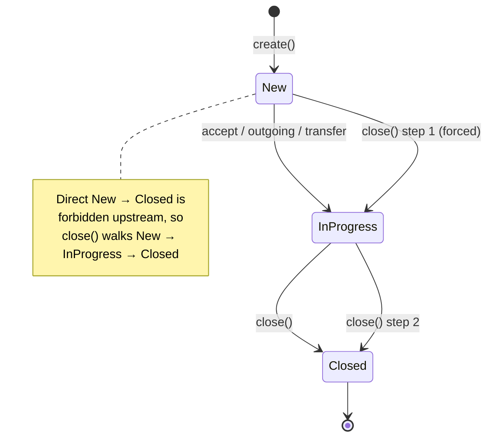

# 6. Value types

[← Writing a plugin](05-writing-a-plugin.md) · [Back to index](README.md)

These are the plain-data types that cross the port boundary. They live in
`include/aid/value-types/` and `include/aid/plumbing/`, link only the standard
library, and carry no behaviour beyond a few trivial helpers. Their in-memory
layout is fingerprinted by the ABI layout tag (see [§5.3](05-writing-a-plugin.md)),
so a plugin and the daemon have to agree on them exactly.

## 6.1 Ids (`value-types/Ids.h`)

Every id type is a thin wrapper over a single `std::string`, told apart only by a
phantom tag — so you can't accidentally pass a `ProjectId` where a `TicketId` is
expected:

```cpp
template <class Tag> struct Id { std::string v; /* empty(), ==, <, std::hash */ };

using CallId        = Id<CallIdTag>;
using TicketId      = Id<TicketIdTag>;
using UserHandle    = Id<UserHandleTag>;   // an operator login
using ProjectId     = Id<ProjectIdTag>;
using StatusId      = Id<StatusIdTag>;     // raw backend status id, e.g. "7"
using CustomFieldId = Id<CustomFieldIdTag>;

struct PhoneNumber { std::string v; /* empty(), ==, <, std::hash */ };

using Timestamp = std::chrono::system_clock::time_point;

enum class TicketStatus { New, InProgress, Closed };
```

Since every `Id<Tag>` has the same layout — one `std::string` — the ABI tag folds
`CallId` in as the representative for all of them.

## 6.2 Ticket & NewTicket (`value-types/Ticket.h`)

`Ticket` is the full state of a work package as the core sees it:

```cpp
struct Ticket {
    TicketId                   id;
    ProjectId                  projectId;
    std::string                subject;
    TicketStatus               status = TicketStatus::New;
    StatusId                   statusId;        // raw backend id behind `status`
    std::optional<UserHandle>  assignee;
    std::vector<CallId>        callIds;         // active call ids on this ticket
    PhoneNumber                callerNumber;
    std::optional<PhoneNumber> calledNumber;
    std::optional<Timestamp>   callStart;
    std::optional<Timestamp>   callEnd;
    std::string                description;      // human-typed notes only
    std::string                callLength;       // auto per-callid call-log lines
    std::vector<UserHandle>    callHandlers;     // every operator who handled a call
    Timestamp                  updatedAt{};
    int                        lockVersion = 0;  // optimistic-lock version
};
```

`NewTicket` is the smaller shape passed to `create`:

```cpp
struct NewTicket {
    ProjectId                  projectId;
    std::string                subject;
    TicketStatus               status = TicketStatus::New;
    CallId                     callId;
    PhoneNumber                callerNumber;
    std::optional<PhoneNumber> calledNumber;
    std::optional<UserHandle>  assignee;
};
```

A handful of fields carry non-obvious meaning that your `TicketStore` has to
preserve:

- **`callIds`** — the set of active call ids attached to the ticket. The `save`
  reducer maintains it as a delta.
- **`callLength`** — the name is misleading: this isn't a duration. It holds
  auto-generated per-call breadcrumb lines (`"{user}: Call start: … ({callid})
  Call End: …"`), kept separate from `description` so they don't pollute human
  notes. (Call *duration* isn't tracked at all any more.)
- **`callHandlers`** — the logins of every operator who accepted, made, or received
  a transfer on this ticket. It drives dashboard visibility independently of
  assignee and project membership.
- **`lockVersion`** — the optimistic-lock token. The `save` reducer machinery uses
  it; your reducer never touches it.

## 6.3 Contact & CallEvent

**`Contact` (`value-types/Contact.h`)** — what `AddressBook::lookup` returns:

```cpp
enum class AddressKind { Person, Company };

struct Contact {
    std::string             name;
    std::string             companyName;
    AddressKind             kind = AddressKind::Person;
    std::vector<PhoneNumber> phoneNumbers;
    std::vector<ProjectId>   projectIds;   // projects this contact routes to
};
```

A contact counts as "known" — routable to specific projects — when `projectIds` is
non-empty; otherwise the call falls back to the configured unknown/incognito
project.

**`CallEvent` (`value-types/CallEvent.h`)** — the internal decoded form of the five
wire shapes from [Chapter 2](02-integrating-call-api.md). You'll only run into it if
you work inside the daemon; a plugin never sees it. Watch the wire→C++ field
mapping:

```cpp
struct IncomingCall { CallId callid; PhoneNumber remote; PhoneNumber dialed; };
struct OutgoingCall { CallId callid; PhoneNumber remote; UserHandle user; };
struct AcceptedCall { CallId callid; PhoneNumber remote; PhoneNumber dialed;
                      std::optional<UserHandle> user; };   // user optional
struct TransferCall { CallId callid; UserHandle newUser; }; // wire field is "newuser"
struct HangupCall   { CallId callid; PhoneNumber remote; };

using CallEvent = std::variant<IncomingCall, OutgoingCall, AcceptedCall,
                               TransferCall, HangupCall>;
```

The wire field `newuser` maps to `TransferCall::newUser`, and
`AcceptedCall::user` is optional (absent for an `<unknown>` connected line).

## 6.4 Error model (`plumbing/`)

Every fallible port method returns `Task<Result<T>>`, where
`Result<T> = std::expected<T, Error>`. Nothing throws across the boundary — you
return an `Error` value instead:

```cpp
enum class ErrorCode {
    InvalidInput, NotFound, Conflict409, LockVersionExhausted,
    UpstreamUnavailable, UpstreamTimeout, Unauthenticated, Forbidden,
    WalWriteFailed, WalSyncFailed, PluginAbiMismatch, InvariantViolation, Unknown,
};

struct Error {
    ErrorCode                  code;           // stable — branch on THIS
    std::string                message;        // human-readable, may be logged
    std::optional<std::string> correlationId;  // propagated from the request
};
```

Rules that matter when you're writing a plugin:

- **Branch on `code`, never on the `message` text.** The message is for humans and
  can change; the code is the stable contract.
- **Never put secrets or PII in `message`** — no tokens, passwords, or unrelated
  contact data — and truncate large bodies.
- Wrap a lower-level failure in the closest matching `code` (a backend `5xx` becomes
  `UpstreamUnavailable`, say), and fill in `correlationId` if you have it in scope.

## 6.5 The ticket state machine

Tickets move through three statuses. The one non-obvious rule is that OpenProject
forbids a direct `New → Closed` transition, so closing a brand-new ticket is a
two-step walk through `InProgress`. The core's `StateTransitions` domain type
encodes this, and the `TicketStore` adapter does the walk (with the `409` retry)
inside `close`.



A `TicketStore` for a backend without this restriction can close directly — but it
still has to honour the `close(TicketId)` contract (idempotent, ends in `Closed`).

## 6.6 Dashboard types (`value-types/Dashboard.h`)

These are what `TicketStore::buildEntry` and `listDashboard` produce, and what the
`/ui` payload and WebSocket frames carry. When you write a plugin, you produce the
`DashboardEntry` values; `ActiveCall` and `DashboardView` are assembled *above* your
plugin by the `GetDashboard` use case.

**`DashboardEntry`** — one row of a viewer's dashboard:

| Field | Meaning |
|---|---|
| `TicketId id` | backend ticket id |
| `std::string subject` | row title |
| `TicketStatus status` | only `New`/`InProgress` tickets ever appear on a board |
| `StatusId statusId` | raw backend status id behind the enum |
| `std::vector<CallId> callIds` | active calls rolled into this ticket |
| `PhoneNumber callerNumber` | the remote party |
| `std::optional<PhoneNumber> calledNumber` | the dialed number, if any |
| `std::optional<UserHandle> assignee` | current single assignee |
| `std::optional<Timestamp> callStart` / `callEnd` | UTC instants; serialized ISO-8601 `…Z`, the browser localizes |
| `std::string href` | deep link to the ticket in the backend web UI |
| `std::string projectName` | human-readable project name |
| `std::optional<CallId> activeCallForViewer` | set iff **this viewer** holds a live call on the ticket (drives the exclusive highlight) |
| `std::vector<UserHandle> otherActiveUsers` | other users with a live call on it |
| `std::string description` | full description: auto call-log lines + typed comments |
| `int lockVersion` | source ticket's lock version; carried at the delta-frame top level so a viewer drops a stale frame (not in the REST JSON) |
| `Timestamp updatedAt` | last-modified instant |

**`ActiveCall`** — the viewer's one active call, surfaced separately: `TicketId
ticketId; CallId callId; std::string projectName; PhoneNumber callerNumber;`.

**`DashboardView`** — the whole `/ui/dashboard` payload: `std::vector<DashboardEntry>
tickets;` (exactly the `listDashboard` result), `std::optional<ActiveCall> active;`
(derived from the first entry whose `activeCallForViewer` is set), and
`std::optional<Contact> addressCallInformation;` (an address-book hint for the
active call's caller, filled via the `AddressBook` port — not the `TicketStore`).

---

Next: [Configuration →](07-configuration.md)
