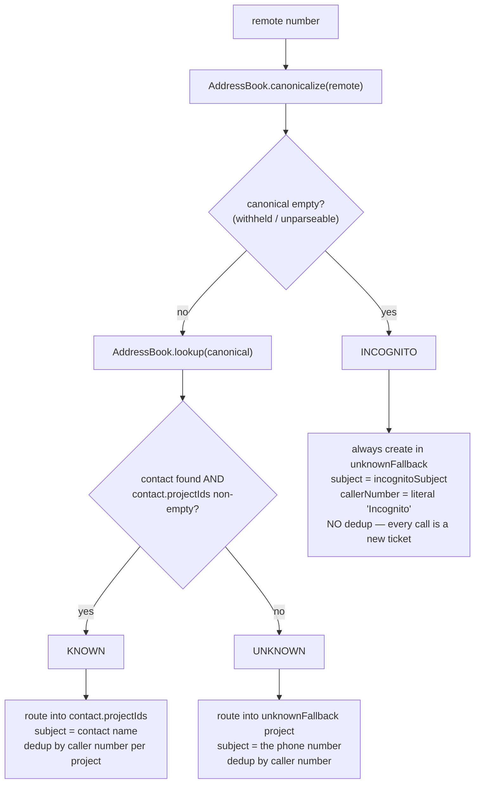

# 9. How calls become tickets

[← Integrating the Address Book](03-integrating-the-address-book.md) · [Back to index](README.md) · companion to [Integrating the Call API](02-integrating-call-api.md)

Chapter 2 covers *what JSON to send*. This chapter covers *what it does* — the
behaviour an integrator has to keep in their head: how a call gets routed to a
project, which events create a ticket versus update one, and what the ticket looks
like once the call is over.

> **Get this straight first:** nothing in a call payload names a project. Routing
> comes from the address book — the caller's number is looked up as a contact, and
> the *contact's* project list decides where the ticket lands. The lever you pull to
> route calls is the CardDAV data, not the `/call` body.

## 9.1 The routing decision

Every `Incoming Call` (and every `Outgoing Call`) runs the same routing preamble on
the `remote` number:

The three outcomes, precisely:

| Path | Condition | Target project | Subject | Dedup? |
|---|---|---|---|---|
| **Known** | contact found *and* has ≥1 `projectId` | the contact's first project that already has an open ticket for this caller, else its first project | contact `name` (or `companyName`) | yes — by caller number, per project |
| **Unknown** | number canonicalizes but no contact / contact has no projects | `TicketRouting.unknownFallback` | the canonical phone number | yes — by caller number |
| **Incognito** | `canonicalize` returns empty (withheld/unparseable) | `TicketRouting.unknownFallback` | `TicketRouting.incognitoSubject` (default `"Incognito Caller"`) | **no** — every withheld call is its own ticket |

Both `unknownFallback` and `incognitoSubject` come from the `TicketRouting` config
section ([Configuration §7.3](07-configuration.md)). A contact whose `projectIds`
list is *empty* counts as Unknown, not Known — filling in a contact without giving
it a project won't route its calls anywhere special.

## 9.2 What each event does to a ticket

This is the heart of the integration. When an event is "load-bearing" it means it
creates or changes a ticket; everything else is recorded but doesn't drive
behaviour.

### `Incoming Call` — CREATE or REUSE (never closes)

- Runs the routing preamble above.
- If an open (`New`/`InProgress`) ticket already exists for this caller in the
  target project, it *reuses* it: the new `callid` is appended to the ticket's
  `callIds`, and nothing else changes (an incoming ring is unassigned).
- Otherwise it *creates* a `New` ticket with the routed subject and project,
  `callerNumber` = the canonical number (or the literal `"Incognito"`), and
  `calledNumber` = `dialed`, but only if you sent a non-empty one.
- Sets `subject`, `status=New` (on create), `callIds`, `callerNumber`, and
  `calledNumber`. It does *not* set assignee, callHandlers, or the call-log line.

### `Accepted Call` — UPDATE only (never creates)

This is the load-bearing event that turns a ringing ticket into a worked one.

- Finds the ticket by `callid` (a substring match over `callIds`). If no ticket
  exists yet it's a silent no-op — an accept can legitimately arrive before its
  incoming, and nothing gets created.
- Requires the `user` handle to resolve (see §9.4); an unresolved or absent user
  makes it a silent no-op.
- On the ticket it sets `assignee` = the operator, but *only if the ticket has
  none* (first handler wins — later accepts never churn the assignee), flips
  `status → InProgress` (unless it's already Closed), sets `callStart = now`, and
  appends an open call-log line to `callLength`.
- Records the operator in `callHandlers` — the CSV that drives dashboard visibility
  independently of the single assignee slot.

### `Outgoing Call` — CREATE or REUSE (never closes)

Think of this as Incoming and Accepted fused into one; there's no separate accept
for an outbound call.

- Resolves the calling operator first (unresolved → silent no-op).
- Runs the same routing preamble as Incoming.
- *Create* gives you a ticket born `InProgress` with the operator as `assignee`, and
  with *no* `calledNumber` (the outgoing shape carries no `dialed`). Records the
  operator in `callHandlers`.
- *Reuse* appends the callid, sets the assignee only-if-empty, flips to
  `InProgress`, and records the handler.
- Note that Outgoing does *not* write a `callLength` breadcrumb line or set
  `callStart`.

### `Transfer Call` — UPDATE only (never creates)

- Finds the ticket by `callid` (substring). Not found → silent no-op.
- Resolves `newuser` (unresolved → silent no-op).
- Flips `status → InProgress` (unless Closed), sets `assignee = newuser` *only if
  empty*, and rewrites the existing call-log line for this callid to the new
  operator's name. Records `newuser` in `callHandlers`.
- It does *not* add the callid to `callIds` — it only retags an existing line.

> **Transfer's `callid` is special.** In the phone protocol, a transfer event's
> `callid` is a *different* Uniqueid from the original call leg — which is exactly
> why the ticket is found by *substring* match and the log line by its `(callid)`
> tag. If that id isn't already part of an open ticket, the transfer quietly does
> nothing.

### `Hangup` — UPDATE only (**does NOT close the ticket**)

This one catches people out: hangup ends the *call*, not the *ticket*.

- Finds the ticket by `callid`. If it's *not* found, that's a hard error — unlike
  the other update events — and the event stays in the WAL for investigation.
- Sets `callEnd = now`, completes the call-log line for this callid (drops the
  `(callid)` tag, appends `Call End: …`), and removes the callid from `callIds`.
- Status is left unchanged on purpose — the ticket stays `InProgress`. Operators
  close tickets by hand from the dashboard (`/ui/close`), which runs the two-step
  `New → InProgress → Closed` walk. Nothing closes automatically.

### Summary table

| Event | Ticket action | Sets / changes | Requires existing ticket? | Gated on user? |
|---|---|---|---|---|
| Incoming Call | create or reuse | subject, status=New, callIds+, callerNumber, calledNumber | no | no |
| Accepted Call | update | assignee(if empty), status→InProgress, callStart, callLength+line, callHandlers+ | no (silent no-op if missing) | yes |
| Outgoing Call | create or reuse | subject, status=InProgress, callIds+, callerNumber, assignee, callHandlers+ | no | yes |
| Transfer Call | update | status→InProgress, assignee(if empty), callLength line retagged, callHandlers+ | yes (silent no-op if missing) | yes |
| Hangup | update | callEnd, callLength line completed, callIds− | yes (**error** if missing) | no |

## 9.3 The call-log breadcrumb (`callLength` field)

Each call writes a human-readable line into the ticket's `callLength` field, kept
separate from `description` (which holds only typed comments). The exact formats:

| Stage | Written by | Format |
|---|---|---|
| Open (on Accept) | `Accepted Call` | `alice: Call start: 2026-07-09 14:03:11 (1699999999.123)` |
| Retagged (on Transfer) | `Transfer Call` | `bob: Call start: 2026-07-09 14:03:11 (1699999999.123)` |
| Completed (on Hangup) | `Hangup` | `alice: Call start: 2026-07-09 14:03:11 Call End: 2026-07-09 14:05:40` |

Timestamps are rendered in local time (Europe/Berlin). On completion the `(callid)`
tag is stripped and `Call End: …` appended. No call *duration* is computed. Multiple
calls on one ticket produce multiple newline-joined lines.

## 9.4 Operator handles must exist in two places

A `user` / `newuser` handle is checked against two independent stores, and failing
either one gets the event silently dropped (acked, not retried) — you won't see an
error come back:

1. **The auth database** (dashboard-login accounts) is checked *before* the use case
   runs, for Accepted/Outgoing/Transfer. A DB error here fails closed — the handle
   is treated as unknown.
2. **The ticket system** (OpenProject users, say) is checked inside the use case via
   `resolveUser`. A handle that doesn't resolve to a backend user is dropped.

So for an operator handle to take full effect — assignment *and* visibility — that
login has to exist in *both* places, as a dashboard user and as a ticket-system
user, spelled identically. The handle format is the backend's exact unique login
string (lowercased first word, per the reference bridge). Incoming and Hangup carry
no user and are never gated.

## 9.5 A full call, ticket state at each step

Known caller *Acme Corp* (contact routes to project `sales`), operator `alice`,
one call with `callid = C1`:

| Step | Event | Resulting ticket state |
|---|---|---|
| 1 | `Incoming Call` (remote=Acme, dialed=+4930…, callid=C1) | **created** in `sales`, subject `"Acme Corp"`, status `New`, `callIds=[C1]`, `callerNumber=+49…`, `calledNumber=+4930…`, unassigned |
| 2 | `Accepted Call` (callid=C1, user=alice) | status → `InProgress`, `assignee=alice`, `callStart=14:03:11`, `callLength="alice: Call start: 14:03:11 (C1)"`, `callHandlers=[alice]` |
| 3 | `Hangup` (callid=C1) | `callEnd=14:05:40`, `callLength="alice: Call start: 14:03:11 Call End: 14:05:40"`, `callIds=[]` (C1 removed), **status still `InProgress`** |

The final ticket: an `InProgress`, alice-assigned `sales` ticket with an empty
`callIds`, one completed call-log line, and `callHandlers=[alice]`. It stays open
until someone closes it from the dashboard.

Notice that `callIds` ends up *empty* — it tracks *active* calls, not history. The
history lives in `callLength` and `callHandlers`.

## 9.6 Reuse & the minimal event set

- A second call from the same known/unknown caller while a ticket is still open
  reuses that ticket (dedup is by caller number over open tickets). A `Closed`
  ticket is never reused, so the next call after a close starts fresh.
- Incognito calls never reuse — every withheld-number call opens a new ticket.
- The minimum for a valid ticket is a single `Incoming Call` (or `Outgoing Call`).
  For an *assigned, in-progress, visible* ticket you need `Incoming → Accepted` (or
  just `Outgoing`, which is already assigned). `Hangup` and `Transfer` both require
  a pre-existing ticket.

---

Next: [Webhook & Health →](04-webhook-and-health.md)
