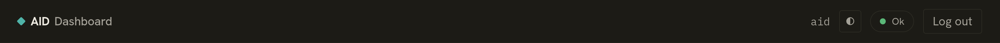
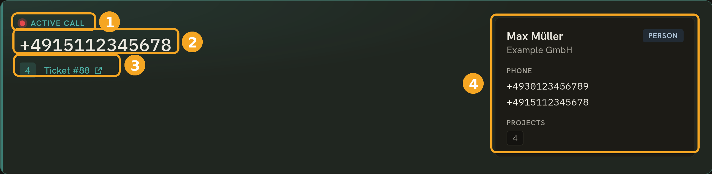
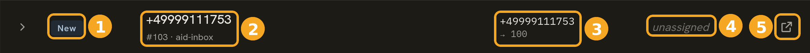
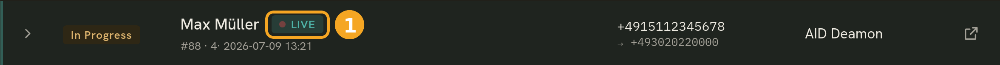
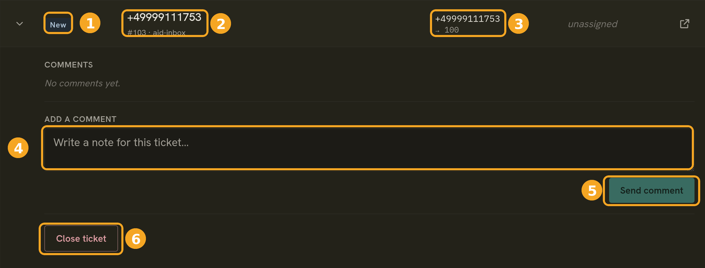

# 3. Using the dashboard

[← Signing in & passwords](02-signing-in.md) · [Back to User Guide](README.md)

The dashboard is your live view of incoming and ongoing calls. It updates on its
own — no need to refresh.

## 3.1 The top bar

From left to right: the **AID Dashboard** logo, and then, over on the right, your
signed-in username, a light/dark theme toggle, a health indicator (it reads **Ok**
when the daemon and its backends are healthy), and **Log out**.

If the health indicator shows anything other than **Ok**, tickets may not be
updating — let your administrator know.

## 3.2 The live-call banner

While you're on a call, a highlighted banner sits at the top of the board so you can
see the current caller at a glance:

1. **Live indicator** — the pulsing "Active call" marker, meaning this call is
   happening right now.
2. **Caller** — the number (or contact name) of the person you're speaking to.
3. **Project & ticket** — the project the call was routed to, plus a link that opens
   the underlying ticket in OpenProject.
4. **Caller contact** — the matched address-book contact: name, company, phone
   numbers, and projects. If the number isn't in your address book, this reads *"No
   matching contact"* instead.

The banner shows up when you accept a call and clears once the call ends.

## 3.3 The ticket list

Below the banner is the list of *open* tickets. (Closed ones drop off the board
automatically — this is a live worklist, not an archive.) Each row is one ticket:

1. **Status** — `New` (ringing, not yet answered) or `In progress` (being handled).
2. **Subject** — the caller's name or number, with the ticket number and project
   just beneath it.
3. **Caller → dialed** — who called, and the number they dialed.
4. **Assignee** — the operator handling it, or *unassigned*.
5. **Open in OpenProject** — jump to the full ticket in OpenProject.

The **Live** marker above the list means the board is streaming updates: rows
appear, change status, and disappear as calls come and go, without a refresh.

## 3.4 Seeing who's on a call

Rows for calls happening *right now* carry a small badge next to the subject, so you
can catch live activity at a glance — your own calls as well as your colleagues'.

**Your own active call** shows a green **LIVE** badge:

1. **LIVE** — you're on this call right now. (It's the same call shown in the big
   banner at the top of the board.)

**A colleague's active call** shows a grey **"<name> · on call"** badge:

1. **"dia · on call"** — another operator (here, *dia*) is on this call right now.
   You can see it because you share the ticket's project, even though the call isn't
   yours.

Between them, these badges let a whole team — or a supervisor watching the board —
see who's tied up on a call at any moment.

## 3.5 Working a ticket — comments & closing

Click a row to expand it and you'll see the call's details along with the actions
you need to work it:

1. **Status** and **2. subject / ticket number / project** — the same summary as the
   collapsed row.
3. **Caller → dialed** — the phone numbers involved.
4. **Add a comment** — jot a note about the call (what the caller wanted, what you
   did). Comments are saved on the ticket.
5. **Send comment** — posts your note; it appears in the comments list above the
   box (and on the ticket in OpenProject).
6. **Close ticket** — marks the ticket done and takes it off the board.

> **Ending a call doesn't close the ticket.** When the caller hangs up, the ticket
> stays **In progress** so you can finish your notes and follow up. Close it yourself
> with **Close ticket** once the work is done.

## 3.6 A typical call, start to finish

1. A call comes in → a **New** ticket appears in the list.
2. You answer → the **live-call banner** shows the caller, and the ticket flips to
   **In progress** with you as the assignee.
3. You add a **comment** describing the call.
4. The caller hangs up → the banner clears, but the ticket stays open.
5. Once you've wrapped up any follow-up, you **Close** the ticket and it leaves the
   board.

---

[← Back to User Guide](README.md)
